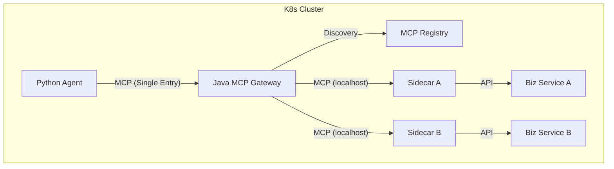

# 企業級 MCP 生態系統願景 (Enterprise MCP Vision)

此設計文檔彙整了與 Gemini 討論後的架構重點，定義了專案從「單一 Sidecar」演進至「大規模微服務 MCP 網關」的藍圖。

## 1. 核心架構：混合棧 (The Hybrid Stack)

為了兼顧穩定性與 AI 生態，我們採用以下分工：
- **Control & Data Plane (Java/Spring Boot)**: 
    - 負責 **Registry (註冊中心)** 與 **Gateway (網關)**。
    - 優勢：穩定的 SSE 長連線管理、K8s 生態整合、類型安全。
- **Agent Orchestration (Python)**:
    - 負責 AI 邏輯、Agent 框架（如 LangChain/CrewAI）。
    - 優勢：豐富的 AI 庫支援、快速實驗。

## 2. 演進路徑：從 Sidecar 到 Gateway

### 關鍵組件定義
- **MCP Sidecar**: 本地化代理，負責將特定業務 API 轉換為 MCP 協議，封裝工具描述與 Schema。
- **MCP Registry (控制面)**: 
    - 透過 **K8s Watcher** 自動偵測 Pod 的增減。
    - **RAG for Tools**: 對所有工具描述進行 Embedding 並建立向量索引。
- **MCP Gateway (數據面)**: 
    - 作為 Aggregator，將多個 Sidecar 聚合為單一 MCP 服務點。
    - 實現 **Zero-buffer Streaming**，確保大流量轉發低延遲。

## 3. RAG for Tools (規模化解決方案)

當後端 API 數量超過 50+ 時，直接傳給模型會導致：
1. **Token 爆炸**：Context Window 被工具描述塞滿。
2. **模型混淆**：過多相似工具增加選錯機率。

**解決方案**：
1. **Semantic Filtering**: Gateway 根據用戶當前問題，透過向量檢索找出最相關的 Top 5-10 個工具。
2. **動態清單**: 僅將篩選後的工具清單傳給 Host，極大化提升準確度與節省成本。

## 4. 動態感知與同步

- **即時重排索引 (Real-time Reindexing)**: 當 Sidecar 加入/離開時，Registry 自動觸發索引更新。
- **主動通知 (List Changed)**: 利用 MCP 協議的 `notifications/tools/list_changed`，通知 Agent 重新更新工具箱。
